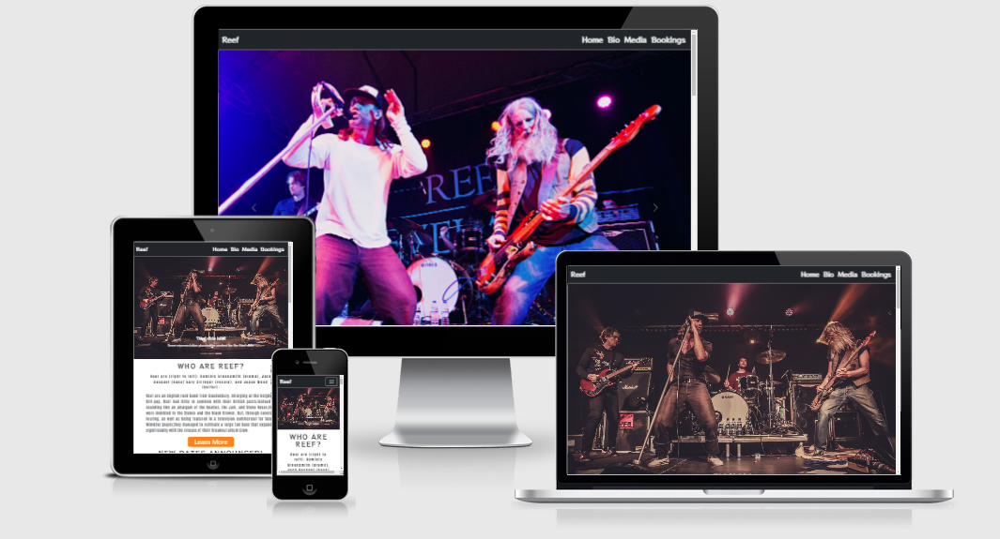

# Milestone Project One - Reef

[Live site can be viewed here](https://j0hn1975.github.io/Milestone-Project-One-Reef/)
## Overview
A website based on a British rock band called Reef. This site is consists of a Home page, a biography of the band - including a brief history of the band and an intro to its members, a tour page, a media page - which will contain pictures and videos, a store page selling the bands merchandise and finally, a contact page where the site visitors can book the band.

The main purpose of the site is for existing fans but also for new fans who are discovering Reef for the first time. These visitors may wish to find out more about the band and even book them for their events.

## UX
## Table of Contents
> 1. [Target Audience](#target-audience)
> 2. [Project Goals](#project-goals)
> 3. [The 5 Planes of UX](#the-5-planes-of-ux)  
    3.1 [Strategy](#strategy)  
    3.2 [Scope](#scope)  
          - i [User Stories](#user-stories)   
          - ii  [Site Owner Goals](#site-owner-goals)    
    3.3 [Structure](#structure)  
    3.4 [Skeleton](#skeleton)  
          - i [Wireframes](#wireframes)   
    3.5 [Surface](#surface)  
          - i [Colours](#colours)  
          - ii [Typography](#typography)  
          - iii [Imagery](#imagery)
> 4. [Features](#features)  
> 5. [Technolgies Used](#technolgies-used)
> 6. [Testing](#testing)  
>   6.1 [Code Validation](#code-validation)  
    6.2 [Device Tests](#device-tests)  
    6.3 [Browser Tests](#browser-tests)  
    6.4 [User Story Tests](#user-story-tests)  
> 7. [Bugs Fixes](#bugs)
> 8. [Deployment](#deployment)
> 10. [Credits](#credits)
> 11. [Acknowledgements](#acknowledgements)

## Target Audience
> * New fans who want to find out more about the band, listen to their music and watch videos.
> * Existing fans wanting to find out about new tour dates, music, and merchandise from the band

# The 5 Planes of UX
## Strategy
## Project Goals
---
The primary business goals of this site are:
> * To promote the band's music and merchandise
> * Increase the overall fan base
> * Sell tickets for upcoming tour dates

The primary customer goals of this site are:
> * To learn more about the band.
> * Find out when the band is on tour and book tickets.
> * Purchase music and merchandise.

## Scope
## User Stories
As a new fan of the band I would like to see:
> 1.  A site that is easy and clear to navigate
> 2.  A biography of the band
> 3.  A brief history of all the band members
> 4.  Old songs from the band
> 5.  An error page to show if I have entered an incorrect URL

As an existing fan of the band I would like to see:
> 6.  Details of live performances.
> 7.  The latest merchandise displayed prominently
> 8.  Picture and videos of the band
> 9.  A bookings page where I can book the band for my events
> 10. Music that I can purchase
> 11. Merchandise that I can purchase

## Site owner goals
The main goal of this site is to present useful information about the band on a website that is easy to navigate.
> 12. Present the end-user with a clear and simple navigation menu
> 13. A button on the 404 page that takes the user back to the Home page

---

## Structure
The website has been structured with 5 web pages (including a 404 error page). Each page is clearly designed, easy to navigate, and with well-laid out information. With a mobile-first approach in mind, I have used bootstrap throughout to make the site responsive on mobile devices.

> The 4 pages are:
> 1. Home Page: A carousel with 3 large clear images of the band, a brief history of the band and intro to the band members, new tour dates announced section, the latest video displayed, a new music section, classic Reef songs from the back catalogue.
> 2. Bio Page: A large clear image of the band is displayed along with a more detailed biography of the band and how they all first met and came to form Reef.
> 3. Media Page: A page that has a single column of 3 videos displayed and pictures laid out in masonry format.
> 4. Bookings Page: A background image of the bass player with a contact form overlayed.
> 5. 404: This alerts users if they have entered an incorrect URL for the site. The user is presented with a warning message, navbar, footer, and button to back to Home Page.
---

## Skeleton
To design and develop the wireframes I first used Balsamiq, then used Snipping Tools to create PNG versions. The wireframes images are designed to collapse.

## Wireframes
> 

Home Page (Desktop)

> 
>

>
> 

Bio Page (Desktop)

> 
> 

> 
> 

Media Page (Desktop)

> 
> 

>
>

Bookings Page (Desktop)

> 
> 

>
>

Home Page (Tablet)

> 
>

>
>

Bio Page (Tablet)

> 
> 

> 
> 

Media Page (Tablet)

> 
> 

>
>

Bookings Page (Tablet)

> 
> 

>
>

Home Page (Mobile)

> 
>

>
>

Bio Page (Mobile)

> 
> 

> 
> 

Media Page (Mobile)

> 
> 

>
>

Bookings Page (Mobile)

> 
> 

---

## Surface
## Colours
Each page is designed with very simple colours and images to showcase the island. The colours I have used are as follows:
> - #CFE1FD - used for nav link and brand hover colour
> - #88B6FC - use for nav link and brand text colour
> - #000000 - used nav bar and footer background, card text, button text, band biography, video card text.
> - #009688 - used to style the quiz text.
> - #1DA1F2 - for Twitter social icon
> - #c5ecfd - for contact form input fields
> - Green - for Spotify social icon
> - Red - for social YouTube icon

## Typography
Throughout the site, I have used 3 Google Fonts chosen for their modern, but clean look and readability. 
All fonts below will fall back to Sans-Serif if Google Font cannot be read by the browser.

Nav links, navbar brand, h1 main-headings (Home and Bio page).
> - [RocknRoll+One](https://fonts.google.com/specimen/RocknRoll+One?query=RocknRoll+One)  

Subheading (Home Page), h6 card headings, card title and text, p tags in video cards.
> - [Anton](https://fonts.google.com/specimen/Anton?query=Anton)

Band Intro
> - [Antonio](https://fonts.google.com/specimen/Antonio?query=Antonio)

## Imagery
Throughout the site I have used large pictures of the band.

## Design
> The site is made up of 5 pages (including an error 404 page). I have used large, clear images of the band mostly in a live setting to give a visual reprenstation of the band's rock music style.  

# Features
## Existing Features
### Feature 1: The Nav Bar
A boostrap and fully responsive nav bar, that has links to Home, Quiz and Contact pages. As part of it bootstrap functionality the nav bar displays as a burger menu on mobile devices. 
> 

NavBar (Desktop)

> 
> 

> 

NavBar (Mobile)

> 
> 

User stories feature relates to:  
* 1.1 A site that is easy and clear to navigate
* 1.12 Present the end user with a clear and simple navigation menu
---
### Feature 2: Image Carousel
Image carousel that cycles through 3 images of the band. The first carousel displays each name of each band member under their respective picture.
> 

Carousel (Image 1)

> 
> 
  
> 

Carousel (Image 2)

> 
> 
  
> 

Carousel (Image 3)

> 
> 
    
User stories feature relates to:      
* 2.3 A brief history of all the band members  
* 2.8 Pictures and videos of the band
---

### Feature 3: New Tour Dates Announced
New Tours Dates Announced section displayed using bootstrap cards
> 

New Tour Dates Announced

> 
> 
  
User stories feature relates to:
* 3.6 Details of live performances
---

### Feature 4: Latest Video
Video of Reef latest single.
>  

New Tour Dates Announced

> 
> 
  
User stories feature relates to:
* 4.8 Pictures and videos of the band
---

### Feature 5: New Music
A small selection of the new music that can be purchased.
> 

New Music

> 
> 
  
User stories this feature relates to:
* 5.4 Old songs from the band  
* 5.10 Music that I can purchase
---

### Feature 6: Classic Reef Songs
> A collection of 4 classic Reef songs using a standard HTML audio player
> 

Classic Reef

> 
> 
  
 User stories this feature relates to:
 * 5.4 Old songs from the band
 ---

### Feature 7: Latest Merchandise
> A small selection of the lastest merchandise from the band.
> 

Latest Merchandise

> 
> 
   
User stories the features relates to:  
* 7.7 The latest merchandide displayed prominently
---

### Feature 8: Shopping Cart Modal
Shopping cart modal where the all the merchandise, tickets and music can be purchased.
>

Shopping Cart

> 
> 
 
User stories the features relates to:   
* 7.10 Music that I can purchase
* 7.11 Merchandise that I can purchase
---

### Feature 9: Footer
Footer with external links to Reef's Spotify, You Tube and Twitter pages.
>

Footer

> 
> 
 
User stories the features relates to:   
* 9.4 Old songs from the band
* 9.8 Pictures and videos of the band
---

### Feature 10: Biography
Biography of the band.
>

Biography

> 
> 
 
User stories the features relates to:   
* 10.2 A biography of the band
* 10.16 An informative biography about the band
---

### Feature 11: Media
Pictures and videos of the band
>

Media

> 
> 
 
User stories the features relates to:   
* 11.4 Old songs from the band
* 11.8 Pictures and videos of the band
* 11.15 A media page with a collection of videos and pictures
---

### Feature 12: Bookings Page
Booking page with a contact form to book the band for your own events.
> 

Media

> 
> 
   
User stories the features relates to:
* 12.9 A bookings page where I can book the band for my own events
* 12.12 Display a contact form so the user can get in touch with the site owner
---

### Feature 13: Error 404 Page
Error 404 page should the user enter a URL incorrectly.
> 

Media

> 
> 
   
User stories the features relates to:
* 13.5 An error page to show if I have enterted an incorrect URL
* 13.14 A button on the 404 page that takes the user back to the Home page
---

## Technolgies Used
> * [HTML5](https://en.wikipedia.org/wiki/HTML5)
> * [CSS3](https://en.wikipedia.org/wiki/CSS)
> * [Javascript](https://en.wikipedia.org/wiki/JavaScript)

## Other Tools and Technologies Used
> * For the wireframes I used [BalSamiq](https://balsamiq.com/)
> * To add the text to the user test screenshots I used [Adobe Photoshop](https://www.adobe.com/uk)
> * For grammar and spell checking I used the free version (not premium) of [Grammarly](https://www.grammarly.com/)

## Testing
## Code Validation
### CSS Validation
I have used the [W3C CSS Validation Service](https://jigsaw.w3.org/css-validator/) Jigsaw to check that my CSS is valid  

CSS validation returned with 0 errors [View Results](docs/css-validation/css-validation.PNG)

---

### HTML Validation
I have used the [W3C Markup Validation Service](https://validator.w3.org/) to check my HTML is valid

>* Home Page - HTML validation returned with 0 errors [View Results](docs/html-validation/HomePage.PNG)
>* Bio Page - HTML validation returned with 0 errors [View Results](docs/html-validation/BioPage.PNG)
>* Media Page - HTML validation returned with 0 errors [View Results](docs/html-validation/MediaPage.PNG)
>* Bookings Page - HTML validation returned with 0 errors [View Results](docs/html-validation/BookingsPage.PNG)
---

### Javascript Validation
I have used [JS Hint](https://jshint.com/) to validate my Javascript.
>* myscript.js - JS Hint validation returned 2 warnings [View Results](docs/js-validation/JSValidation.PNG)

---

### WAVE Accessibility
I have used the [WAVE Web Accessibility Evaluation Tool](https://wave.webaim.org/) to ensure site is accessible
>* Home Page - WAVE validation returned 0 error, 0 contrast errors [View Results](docs/accessibilty/HomePage.PNG)
>* Bio Page - WAVE validation returned 0 error, 0 contrast errors [View Results](docs/accessibilty/BioPage.PNG)
>* Media Page - WAVE validation returned 0 error, 0 contrast errors [View Results](docs/accessibilty/MediaPage.PNG)
>* Booking Page - WAVE validation returned 0 error, 0 contrast errors [View Results](docs/accessibilty/BookingPage.PNG)

--- 

### Lighthouse Performance
I have used Google Lighthouse (in Google Dev tools) to measure the performance of the site
>* Home Page (Desktop) - 98 Performance, 93 Accessibility, 100 Best Practices, 80 Seo [View Results](docs/lighthouse/desktop/HomePage.PNG)
>* Bio Page (Desktop) - 97 Performance, 100 Accessibility, 93 Best Practices, 90 Seo [View Results](docs/lighthouse/desktop/BioPage.PNG)
>* Media Page (Desktop) - 85 Performance, 98 Accessibility, 87 Best Practices, 90 Seo [View Results](docs/lighthouse/desktop/MediaPage.PNG)
>* Bookings Page (Desktop) - 98 Performance, 100 Accessibility, 93 Best Practices, 90 Seo [View Results](docs/lighthouse/desktop/BookingPage.PNG)
>
>* Home Page (Mobile) - 84 Performance, 93 Accessibility, 100 Best Practices, 83 Seo [View Results](docs/lighthouse/mobile/HomePage.PNG)
>* Bio Page (Mobile) - 82 Performance, 100 Accessibility, 93 Best Practices, 92 Seo [View Results](docs/lighthouse/mobile/BioPage.PNG)
>* Media Page (Mobile) - 91 Performance, 98 Accessibility, 87 Best Practices, 92 Seo [View Results](docs/lighthouse/mobile/MediaPage.PNG)
>* Bookings Page (Mobile) - 83 Performance, 100 Accessibility, 93 Best Practices, 92 Seo [View Results](docs/lighthouse/mobile/BookingsPage.PNG)

--- 

### Device Tests
The site has been tested on the following physical devices
> - Huawei P30 Pro
> - HP Envy 17 Laptop
> - Samsung Galaxy A31

Actual tests:
> 1. Home, Bio, Media and Bookings nav links all go to the correct pages. Clicking the Reef brand logo navigates back to the Home page from each page.
> 2. The nav collapses to a burger menu, which pushes the content down when clicked on. All nav links work as expected here too.
> 3. The 4 audio tracks all play when clicked on the desktop and mobile devices.
> 4. All videos on the Media play when clicked on on both mobile and desktop devices
> 5. The Learn More and Watch More buttons go to the Bio and Media pages respectively
> 6. When clicking on Buy Tickets and Merchandise button the Shopping Cart modal loads on both desktop and mobile devices
> 7. All pages are responsive.
> 8. The main (latest video) on the Home Page plays loads and plays on both desktop and mobile devices
> 10. Each of the four nav links and logo brand text colour change to white when clicked/hovered on.
> 11. A 404 error page will be displayed in the event an incorrect URL is entered. The standard nav can be used to navigate back to the site pages.
> 12. The Spotify, YouTube and Twitter social links go to their respective pages, each opening in a separate tab

Overall results:
> * The above physical tests passed on each device they were tested on.

### Browser Tests
> * Firefox Developer Edition - All nav links, features and website work as expected
> * Google Chrome - All nav links, features and website work as expected
> * Firefox Developer Edition - All nav links, features and website work as expected

### User story tests
> 1. A site that is easy and clear to navigate

|                    Feature                    |             Test Steps             |           Expected            |       Actual       |
| :-------------------------------------------: | :--------------------------------: | :---------------------------: | :----------------: |
| A website that is easy and clear to navigate. | Clicked on nav links for each page | Pages to load when clicked on | Works as expected |

[User story screenshot](docs/Features/homepage.PNG)  

> 2. A biography of the band

|                   Feature                    |                          Test Steps                          |    Expected    |      Actual       |
| :------------------------------------------: | :----------------------------------------------------------: | :------------: | :---------------: |
|      Display a biography of the band.        | Navigate to Bio page scroll down to Bio underneath image     | Biography to display | Works as expected |  

[User story screenshot](docs/user-story-testing/userstorytest_2.PNG)  

> 3. A brief history of all the band members

|                           Feature                           |       Test Steps                       |               Expected                |      Actual       |
| :---------------------------------------------------------: | :------------------------------------: | :-----------------------------------: | :---------------: |
|       Display a brief history of the band                   | Navigate to the home page and scroll down  |      Who are Reef section to display  | Works as expected |

[User story screenshot](docs/user-story-testing/userstorytest_3.PNG)

> 4. Old songs from the band

|                Feature                 |                          Test Steps                          |               Expected                |      Actual       |
| :------------------------------------: | :----------------------------------------------------------: | :-----------------------------------: | :---------------: |
|        Classic songs from Reef         | Navigate to Home Page and scroll down to Classic Reef section|  4 audio tracks available to play     | Works as expected |

[User story screenshot](docs/user-story-testing/userstorytest_4.PNG)

> 5. An error page to show if I have entered an incorrect URL

|                         Feature                         |                     Test Steps                      |           Expected            |      Actual       |
| :-----------------------------------------------------: | :-------------------------------------------------: | :---------------------------: | :---------------: |
| Error 404 page will display if incorrect URL entered    | Added an extra letter at end of the page URL's      | 404 page to display           | Works as expected |

[User story screenshot](docs/user-story-testing/userstorytest_5.PNG)  

> 6. Details of live performances

|             Feature              |          Test Steps                                        |             Expected             |      Actual       |
| :------------------------------: | :--------------------------------------------------------: | :------------------------------: | :---------------: |
| New Tour Dates Announced section | Navigate tp Home page and scroll down to new New Tour Dates | Correct answer to be highlighted | Works as expected |

[User story screenshot](docs/user-story-testing/userstorytest_6.PNG)  

> 7. The latest merchandise displayed prominently

|                  Feature                   |   Test Steps                                                |       Expected           |      Actual       |
| :----------------------------------------: | :---------------------------------------------------------: | :----------------------: | :---------------: |
| Display merchandise that can be purchased  | Navigate to Home Page and scroll down to Latest Merchandise | Merchandise is displayed | Works as expected |

[User story screenshot](docs/user-story-testing/userstorytest_7.PNG)

> 8. Pictures and videos of the band

|                    Feature                      |   Test Steps           |                    Expected                     |      Actual       |
| :---------------------------------------------: | :--------------------: | :---------------------------------------------: | :---------------: |
| Videos and pictures displayed on the Media Page | Navigate to Media Page | videos and pictures to be displayed             | Works as expected |

[User story screenshot](docs/user-story-testing/userstorytest_8.PNG)  

> 9. A bookings page where I can book the band for my events

|                   Feature                    |      Test Steps          |             Expected             |      Actual       |
| :-----------------------------------------:  | :------------------:     | :------------------------------: | :---------------: |
| Bookings page for user to book band          | Clicked on Bookings page | Contact form page to be displayed | Works as expected |

[User story screenshot](docs/user-story-testing/userstorytest_9.PNG) 

> 10. Music that I can purchase

|              Feature                  |             Test Steps                                             |      Expected                    |      Actual       |
| :-----------------------------------: | :----------------------------------------------------------------: | :------------------------------: | :---------------: |
|  Buy Tickets and Merchandise button   | Navigate to Home Page, click on Buy Tickets and Merchandise button |  Shopping cart modal to pop up   | Works as expected |

[User story screenshot](docs/Features/examplesofvalidation.PNG) 

> 11. Merchandise that I can purchase

|              Feature                  |             Test Steps                                             |      Expected                    |      Actual       |
| :-----------------------------------: | :----------------------------------------------------------------: | :------------------------------: | :---------------: |
|  Buy Tickets and Merchandise button   | Navigate to Home Page, click on Buy Tickets and Merchandise button |   Shopping cart modal to pop up  | Works as expected |  

[User story screenshot](docs/user-story-testing/userstorytest_11.PNG)

> 12. Present the end-user with a clear and simple navigation menu

|                   Feature            |          Test Steps          |             Expected                   |      Actual       |
| :----------------------------------: | :--------------------------: | :------------------------------------: | :---------------: |
| Nav bar laid out with 5 links        |        Loaded site           | Nav bar to display across the top of the page. | Works as expected |

[User story screenshot](docs/user-story-testing/userstorytest_12.PNG)  

> 13. A button on the 404 page that takes the user back to the Home page

|                         Feature              |     Test Steps                      |        Expected                          |      Actual       |
| :------------------------------------------: | :---------------------------------: | :---------------------------------------:| :---------------: |
|        A Home button on the 404 page         | Load 404 page, click on Home button | Navigate away from 404 page to Home page | Works as expected |  

[User story screenshot](docs/user-story-testing/userstorytest_13.PNG)  

---

# Bugs
> **Bug**  Mobile nav not pushing content down - all pages.  
> **Fix** Added JS Boostrap 5 CDN to bottom of all pages
>
> **Bug** Social links not opening in separate tab.  
> **Fix** Added **target="_blank"**
>
> **Bug** 3 video cards not centered on media page.  
> **Fix** Add **justify-content: center;** to **.video-cards**  css class.

# Deployment

I have deployed this site to GitHub pages

> 1. Log in to git hub and find the repository you wish to deploy
> 2. On the repository click on **Settings**
> 3. From left the hand menu click on **Pages**
> 4. Click on the **Source** option
> 5. From the dropdown change **none** to **master branch**
> 6. The deployment will take a few moments to finalise
> 7. The live site URL is now displayed under Github Pages

Clone site locally

> 1. Log in to Github and navigate to the main page of the repository
> 2. Click on **Code** above the list of files
> 3. Copy the link under clone to HTTPS
> 4. Open Git Bash
> 5. If required change the directory to where you would like the repo cloned to
> 6. Type git clone and then copy in repo URL
> 7. Press enter and the repo will go through a short cloning process
---

# Credits
> * Select menu used on Home (index.html) page credited to - http://jsfiddle.net/k148pk76/1/
> * Masonry layout credited to Saief Al Emon - https://codepen.io/iamsaief/pen/jObaoKo
> * Contact form and validation JS credited to Coding Market https://www.youtube.com/watch?v=WY4rvU4ImgE
> * Responsive column layout used on Media page credited to Travis Horn - https://travishorn.com/responsive-grid-in-2-minutes-with-css-grid-layout-4842a41420fe

# Acknowledgements
> * Mo Shami for his external patience and guidance
> * My partner Laura who has not seen that much of me during MS1